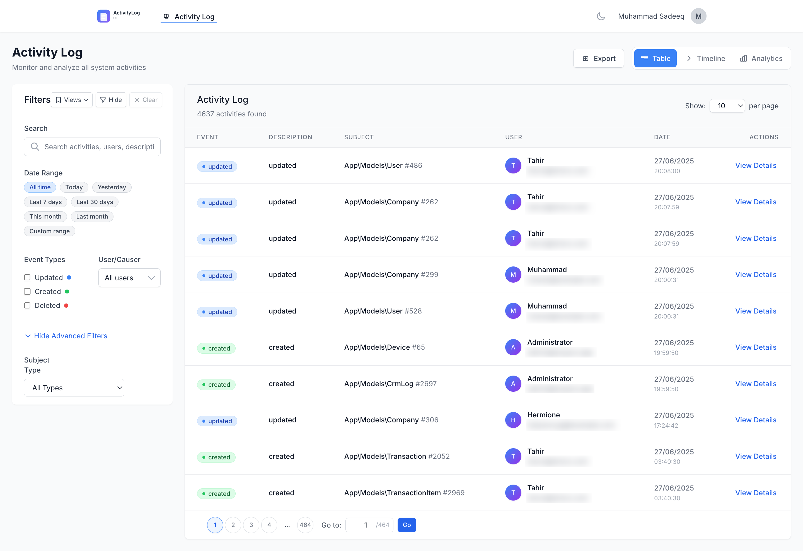

# Laravel Activity Log UI

> Beautiful, modern UI for [Spatie's Activity Log](https://github.com/spatie/laravel-activitylog)
>
> **Important:** This package **assumes you already have Spatie's Activity Log installed and configured** in your Laravel application.  It does *not* replace the logging package—only provides a powerful UI for viewing and analyzing the stored activities.



---

## 📖 Documentation

📚 **[Complete Documentation](https://www.sadeeq.dev/docs/laravel-activitylog-ui)** - Comprehensive guide with advanced features, customization options, and troubleshooting.

---

## ✨ Features

* Table, Timeline & Analytics dashboards
* Powerful filter panel (date presets, events, users, subjects, search)
* Saved views, per-page & sorting preferences
* Export to **CSV / Excel / PDF / JSON**  
  \* Optional Excel & PDF exports require additional packages (see below)
* Real-time count & pagination powered by Laravel cache
* Authorization gate, middleware & granular access lists
* Tailwind CSS & Alpine.js – no build step required

## 🗒️ Requirements

* PHP ≥ 8.1
* Laravel 10 | 11 | 12
* [spatie/laravel-activitylog](https://github.com/spatie/laravel-activitylog) ≥ 4.8 (already logging your activities)
* Database table `activity_log` with Spatie’s default columns

### Optional (for export)

| Feature | Package | Version |
|---------|---------|---------|
| Excel (XLSX) | `maatwebsite/excel` | ^3.1 |
| PDF | `barryvdh/laravel-dompdf` | ^2.0 |

Add them when you need those formats:
```bash
composer require maatwebsite/excel barryvdh/laravel-dompdf
```

---

## 🚀 Installation

1. **Install the package**
   ```bash
   composer require muhammadsadeeq/laravel-activitylog-ui
   ```
2. **(Optional) Publish resources**
   ```bash
   # Config file (config/activitylog-ui.php)
   php artisan vendor:publish --provider="MuhammadSadeeq\ActivitylogUi\ActivitylogUiServiceProvider" --tag="activitylog-ui-config"

   # Blade views (if you want to customise)
   php artisan vendor:publish --provider="MuhammadSadeeq\ActivitylogUi\ActivitylogUiServiceProvider" --tag="activitylog-ui-views"

   # Public assets (logo, js, css)
   php artisan vendor:publish --provider="MuhammadSadeeq\ActivitylogUi\ActivitylogUiServiceProvider" --tag="activitylog-ui-assets"
   ```
3. **Run migrations**   
   Ensure you have already run Spatie’s migrations so the `activity_log` table exists:
   ```bash
   php artisan vendor:publish --provider="Spatie\Activitylog\ActivitylogServiceProvider" --tag="activitylog-migrations"
   php artisan migrate
   ```
4. **Visit the UI**   
   ```
   /activitylog-ui   # default route prefix
   ```

---

## ⚙️ Configuration Overview

A full configuration file is published to `config/activitylog-ui.php`.  Below is a quick reference:

```php
return [
    'route' => [
        'prefix' => 'activitylog-ui', // URL prefix
        'middleware' => null,         // Auto-detected or custom array
    ],

    'authorization' => [
        'enabled' => false,           // true => uses Gate / auth middleware
        'gate'    => 'viewActivityLogUi',
    ],

    'access' => [
        'allowed_users' => [],        // user email whitelist
        'allowed_roles' => [],        // role names (Spatie Permission, etc.)
    ],

    'features' => [
        'analytics' => true,
        'exports'   => true,
        'saved_views' => true,
    ],

    'exports' => [
        'enabled_formats' => ['csv', 'xlsx', 'pdf', 'json'],
        'max_records'     => 10000,
        'queue' => [
            'enabled'   => false,
            'threshold' => 1000,
            'queue_name'=> 'exports',
        ],
    ],
];
```
Refer to the inline comments in the file for every available option.

---

## 🔐 Authorization & Access Control

* **Gate:** `viewActivityLogUi` is auto-registered (see `ActivitylogUiServiceProvider`).  You may define it in your own code or rely on the package’s default email/role checks.
* **Toggle authentication:** Set `authorization.enabled` to `true` to require login + gate.
* **Granular lists:** `access.allowed_users` and `access.allowed_roles` let you open the UI to a subset of users—regardless of the gate.

---

## 📤 Exports

* **CSV & JSON** work out-of-the-box.
* **Excel (XLSX)** requires `maatwebsite/excel` – otherwise we gracefully fall back to CSV.
* **PDF** requires `barryvdh/laravel-dompdf` – otherwise we fall back to JSON.
* Large exports can be **queued**; enable `exports.queue.enabled`.

---

## 📈 Analytics Dashboard

Enable/disable with `features.analytics`.  Caches stats for `analytics.cache_duration` seconds (default 1 h).

---

## 🤝 Contributing

PRs and issues are welcome!

---

## 📝 License

The MIT License (MIT).  See `LICENSE` for details. 

[](https://packagist.org/packages/muhammadsadeeq/laravel-activitylog-ui)
[](https://packagist.org/packages/muhammadsadeeq/laravel-activitylog-ui)
